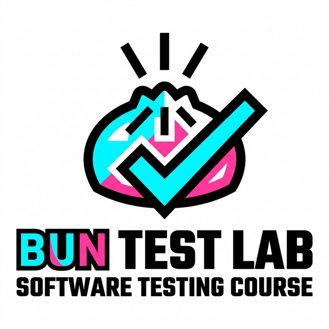

# Testing com Bun (Opcional 2)



Uma plataforma educacional interativa de "Testing com Bun.js" desenvolvida para estudantes do 4º ano universitário na disciplina Opcional 2. Construída com um design único **Neo-Brutalist Technical**, esta aplicação apresenta o paradigma moderno de testes com o runtime ultra-rápido Bun.js.

## 🚀 Tecnologias e Stack

A aplicação foi construída visando máxima performance, testabilidade e tipagem severa:

- **Framework Core**: React 19 + Vite
- **Linguagem**: TypeScript
- **Estilo e UI**: Tailwind CSS v4
- **Roteamento**: React Router DOM (Single Page Application)
- **Ícones**: Lucide React
- **Estética**: Neo-Brutalist Technical (Alto contraste, grandes sombras, tipografia pesada `Bricolage Grotesque` e `Manrope`)
- **Runtime e Ferramentas**: Bun.js (para gerenciamento de pacotes, dev server e testes)

## ✨ Funcionalidades

- **Design Neo-Brutalist**: Interface única, agressiva e acadêmico/técnica com modo Claro/Escuro (Dark Mode).
- **Conteúdo Didático Dinâmico**: Os módulos e conferências (Módulos 1 a 9) sobre testes com Bun são geridos de forma modular localmente com roteamento condicional.
- **Sistema Condicional de IA**: Uma janela de chat para integração futura (com feedback local implementado) via Gemini API.
- **Baixar Regulamento**: Um sistema de avaliação detalhado com pesos que pode ser exportado para `.txt` internamente (na aba `Avaliação`).

## 🛠 Como Rodar o Projeto Localmente

Certifique-se de que de que tenha o [Bun](https://bun.sh/) instalado na sua máquina!

1. Clone o repositório ou acesse a pasta raiz:
   ```bash
   cd opcional2-web
   ```

2. Instale todas as dependências do projeto (ultra-rápido usando Bun):
   ```bash
   bun install
   ```

3. Inicie o servidor de desenvolvimento:
   ```bash
   bun run dev
   ```

4. Acesse a aplicação, tipicamente em `http://localhost:5173`.

## 📁 Estrutura do Projeto

- `src/components/`: Componentes reutilizáveis (Layout, Sidebar, ChatModal, CodeBlock, etc).
- `src/pages/`: As páginas principais da aplicação (Inicio, Avaliacao, Bibliografia, Conferencias, etc).
- `src/content/`: Toda a documentação dos cursos dividida em módulos. Cada módulo (`modulo-1`, `modulo-2`, etc) possui suas próprias aulas e código para o `ConferenceReader`.
- `public/`: Mídias locais como o `logo.png` e `favicon.png`.

## 📜 Licença

Este projeto é um material acadêmico para fins de estudo e ensino de testes modernos com Bun.js.
